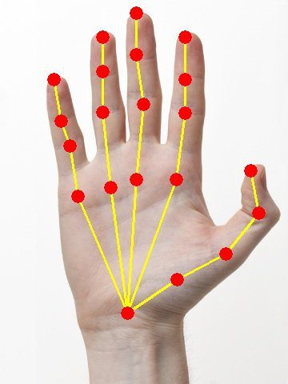

# Gesture Recognition App using React JS

## Live Page - https://jojugeorge.github.io/gesture-recognition-v1/

### Technologies Used

- React JS
- Tensorflow JS
  - Handpose
- Fingerpose

## Dependencies

- react-webcam
- @tensorflow/tfjs
- @tensorflow-models/handpose

